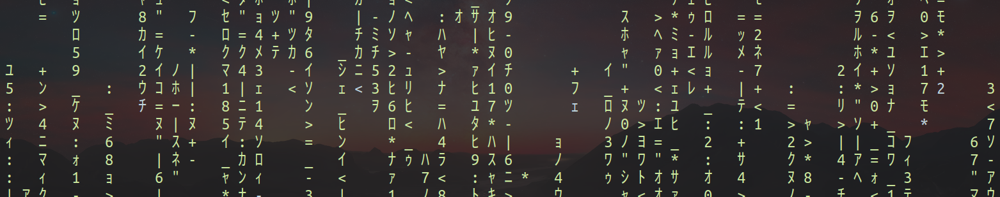

  

## About Me

I'm a physicist and data scientist with a background in complex systems and healthcare analytics. Currently, I work as a Data Science Instructor at [TripleTen](https://tripleten.com), where I guide students through Python, machine learning, and real-world data projects. Previously, I contributed to clinical data solutions at [Carta Healthcare](https://www.carta.healthcare), developing ML pipelines and NLP tools for electronic health records.

- PhD in Physics Applied to Medicine and Biology – University of São Paulo (USP)
- Experience working remotely with US-based teams in healthcare and EdTech
- Skilled in Python, ML frameworks (Scikit-learn, TensorFlow, PyTorch), FastAPI, LangChain, Langraph, and cloud tools like Docker and AWS
- Trilingual: English, Spanish, Portuguese

---

## Tools & Skills

**Languages**: Python, JavaScript, SQL  
**ML Libraries**: Scikit-learn, XGBoost, PyTorch, TensorFlow, HuggingFace  
**Data Handling**: Pandas, NumPy, DVC, FHIR, HL7  
**Web & APIs**: FastAPI, Flask, Streamlit  
**Data Viz**: Matplotlib, Seaborn, Plotly  
**Infra**: Docker, AWS (S3), PostgreSQL, Elasticsearch  
**Workflow**: Git, Bash, Jupyter, Pytest, Agile/Scrum  
**LLM Tools**: LangChain, Langraph, OpenAI API

  

---

## Publications

I’ve published research in journals like [CHAOS](https://pubs.aip.org/aip/cha) and [Chaos, Solitons & Fractals](https://www.sciencedirect.com/journal/chaos-solitons-and-fractals), covering synchronization, dynamical systems, and economic models. See full list on [Google Scholar](https://scholar.google.com/citations?user=rotxSnAAAAAJ&hl=pt-BR) or [ORCID](https://orcid.org/0000-0002-8974-2988).

---